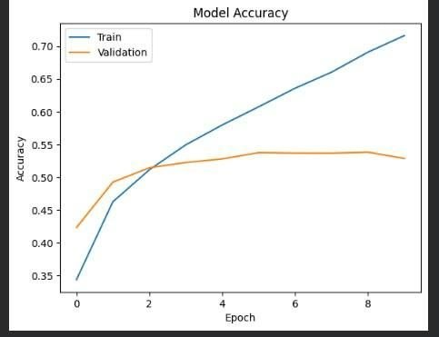
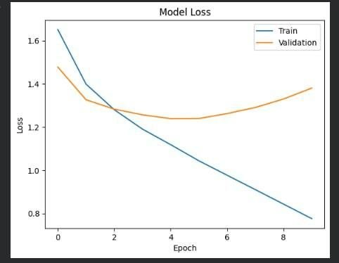
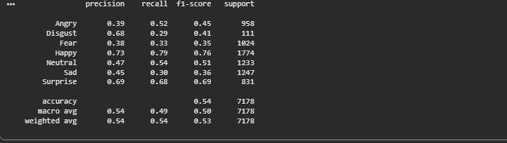
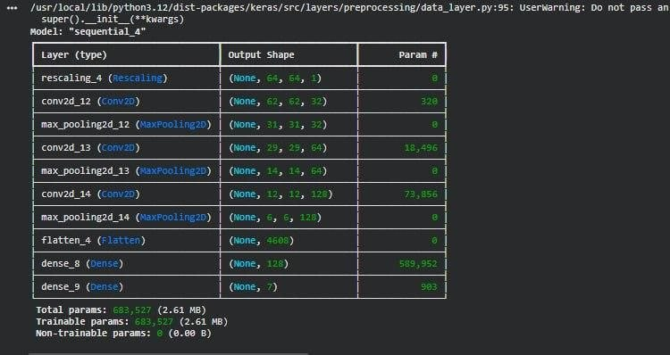
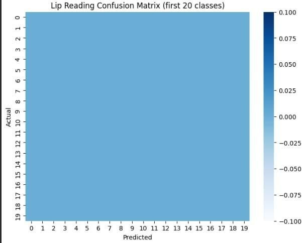

# 🎙️ Emotion-Aware Visual Speech Recognition in Conversational Environments

A multimodal deep learning project that integrates **facial emotion recognition**, **lip movement analysis**, and **live speech processing** to improve contextual speech prediction in conversational environments.

---

# 📖 Overview

This project combines computer vision and speech processing techniques to analyze facial expressions, lip movements, and live audio. By integrating visual and audio information, the system improves contextual speech prediction and enhances speech understanding in real-time conversational environments.

---

# ✨ Features

- 😊 Facial Emotion Recognition
- 👄 Visual Speech (Lip Movement Analysis)
- 🎤 Live Audio Recording
- 🎵 MFCC Feature Extraction using Librosa
- 🤖 Transformer-based Speech Processing
- ⚡ Real-Time Contextual Speech Prediction
- 🧠 Multimodal Audio-Visual Learning

---

# 🛠️ Technology Stack

- 🐍 Python
- 🧠 TensorFlow
- 🔬 Keras
- 👁️ OpenCV
- 🎵 Librosa
- 🤗 Hugging Face Transformers
- 📊 Scikit-learn
- 💾 Joblib
- 🔢 NumPy
- 🐼 Pandas
- 📈 Matplotlib
- ☁️ Google Colab
- 💻 Visual Studio Code
- 🌿 Git & GitHub

---

# 📂 Datasets

- 📸 FER2013 – Facial Emotion Recognition Dataset
- 🎙️ CREMA-D – Speech Emotion Recognition Dataset
- 👄 Lip Reading Dataset

### 🔗 Dataset Links

- **FER2013 (Facial Emotion Recognition):** https://www.kaggle.com/datasets/msambare/fer2013
- **Lip Reading Dataset:** https://www.kaggle.com/datasets/gpiosenka/lip-reading
- **CREMA-D (Speech Emotion Recognition):** https://www.kaggle.com/datasets/ejlok1/cremad

---

# ⚙️ Methodology

1. 🎤 Capture live audio from the microphone.
2. 📷 Capture facial expressions using the webcam.
3. 😊 Detect facial emotions using a trained deep learning model.
4. 👄 Extract lip movement features from video frames.
5. 🎵 Extract MFCC features from audio using Librosa.
6. 🤖 Process speech using Transformer models.
7. 🔄 Fuse audio and visual features.
8. 📢 Generate context-aware speech predictions.

---

# 🚀 Usage

### Clone the Repository

```bash
git clone https://github.com/HimanshuS-arch/Emotion-aware-visual-speech-recognition.git
```

### Install Dependencies

```bash
pip install -r requirements.txt
```

### Run the Project

```bash
jupyter notebook
```

Open the notebook and run all cells to execute the complete pipeline.

---

# 🌍 Applications

- 🤖 Human-Computer Interaction
- 🗣️ Emotion-Aware Virtual Assistants
- ♿ Assistive Communication Systems
- 🏥 Healthcare and Patient Monitoring
- 🎓 Smart Education Systems
- 📹 Video Conferencing Analytics
- 🌐 Accessibility Solutions
- 🔬 Multimodal Artificial Intelligence Research

---

# 📁 Project Structure
```
Emotion-aware-visual-speech-recognition/
│
├── assets/
│   ├── model_accuracy.png
│   ├── model_loss.png
│   ├── emotion_confusion_matric.png
│   ├── lip_reading_confusion_matrix.png
├── normalised_emotion_confusion_matrix.png
│   └── epoch10.png
├──
├── Emotion-aware-visual-speech-recognition.ipynb
├── requirements.txt
└── README.md
```

---

### 📈 Model Accuracy



### 📉 Model Loss



### 😊 Emotion Confusion Matrix



### 📊 Normalized Emotion Confusion Matrix



### 👄 Lip Reading Confusion Matrix



### ⏱️ Training Progress (Epoch 10)


---

# 🚀 Future Improvements

- Improve multimodal feature fusion
- Support multilingual speech recognition
- Optimize real-time inference
- Deploy as a web application
- Train on larger and more diverse datasets

---

# 📚 References

- FER2013 Dataset
- CREMA-D Dataset
- Lip Reading Dataset
- TensorFlow Documentation
- OpenCV Documentation
- Librosa Documentation
- Hugging Face Transformers Documentation
- Scikit-learn Documentation

---

# 👨‍💻 Author

**Himanshu Saroj**

**B.Tech – Information Technology**

**Harcourt Butler Technical University, Kanpur**

🔗 **GitHub:** https://github.com/HimanshuS-arch

---

# ⭐ Support

If you found this project useful, consider giving this repository a ⭐ on GitHub.
